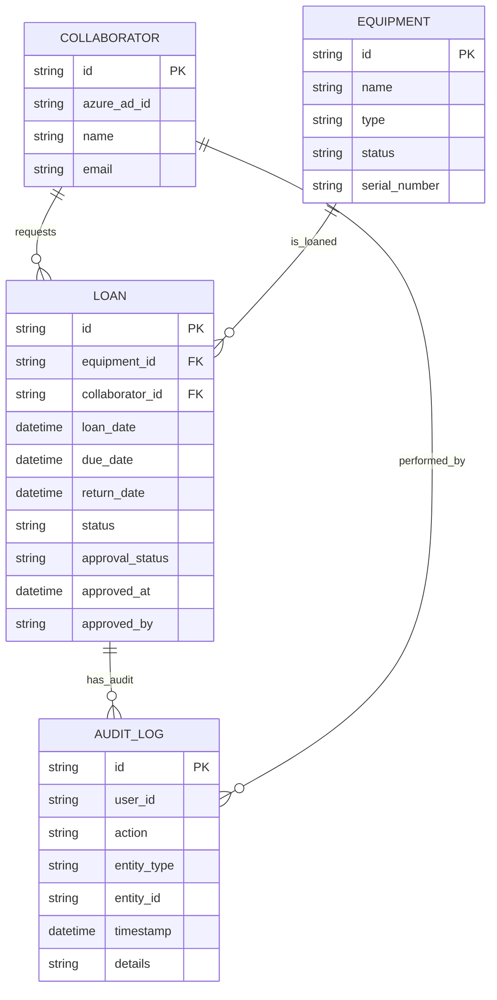

# Arquitectura - Préstamo de Equipos Apiux

## 1. Visión General

Sistema web interno para gestionar préstamos de equipos de TI en Apiux. Reemplaza el manejo manual con planillas compartidas por una aplicación centralizada con trazabilidad completa.

## 2. Stack Tecnológico

| Componente | Tecnología | Versión |
|------------|------------|---------|
| Backend Runtime | Node.js | 20 |
| Framework Backend | NestJS | 10.x |
| Base de Datos | PostgreSQL | 15 |
| Frontend Framework | React | 18 |
| Build Tool | Vite | 5.x |
| Lenguaje Frontend | TypeScript | 5.x |
| Contenedores | Docker | Latest |
| Autenticación | Azure AD SDK | @azure/msal-node 2.x |
| Plataforma Cloud | GCP | Cloud Run / App Engine |
| ORM | TypeORM | 0.3.x |

## 3. Arquitectura de Alto Nivel

```
┌─────────────┐     ┌─────────────┐     ┌─────────────┐
│   Frontend   │────▶│   Backend   │────▶│  PostgreSQL │
│   (React)   │◀────│  (NestJS)   │◀────│   (Cloud SQL)│
│   :3000     │     │   :8000     │     │    :5432    │
└─────────────┘     └─────────────┘     └─────────────┘
       │                  │
       │                  ▼
       │           ┌─────────────┐
       │           │  Azure AD   │
       │           │  (Auth)     │
       └──────────▶└─────────────┘
```

## 4. Componentes Principales

### 4.1 Módulo de Autenticación (Azure AD)
- Integración con Azure AD mediante MSAL
- Autenticación de usuarios del dominio api-ux.com
- JWT tokens almacenados en HTTP-only cookies
- Middleware de autenticación en todos los endpoints protegidos

### 4.2 Módulo de Gestión de Inventario
- CRUD completo de equipos
- Estados: available, loaned, maintenance, retired
- Tipos: notebook, monitor, accessories
- Búsqueda y filtros por tipo/estado

### 4.3 Módulo de Gestión de Préstamos
- Solicitud de préstamos por colaboradores
- Aprobación/rechazo por encargados de inventario
- Registro de entregas y devoluciones
- Historial de préstamos por usuario

### 4.4 Módulo de Auditoría
- Registro inmutable de todas las acciones
- Información: usuario, acción, entidad, timestamp, detalles
- Trazabilidad completa del ciclo de vida de cada préstamo

### 4.5 Módulo de Notificaciones
- Alertas por correo electrónico
- Eventos: solicitudes pendientes, aprobaciones, devoluciones

## 5. Modelo de Datos (ERD)



## 6. Diagrama de Despliegue (GCP)

```
                    ┌─────────────────────────────────────┐
                    │          Google Cloud Platform       │
                    │                                      │
┌─────────────┐     │  ┌─────────────────────────────────┐ │
│   Usuario   │────▶│  │        Cloud Run                  │ │
│  (Browser)  │◀────│  │  ┌───────────┐ ┌───────────┐    │ │
└─────────────┘     │  │  │  Backend  │ │  Frontend │    │ │
                    │  │  │  (NestJS) │ │   (React) │    │ │
                    │  │  └─────┬─────┘ └─────┬─────┘    │ │
                    │  │        │             │          │ │
                    │  │        └──────┬──────┘          │ │
                    │  │               │                 │ │
                    │  │        ┌──────▼──────┐          │ │
                    │  │        │  Cloud SQL   │          │ │
                    │  │        │ (PostgreSQL)│          │ │
                    │  │        └─────────────┘          │ │
                    │  └─────────────────────────────────┘ │
                    │                                      │
                    │  ┌─────────────────────────────────┐ │
                    │  │       Secret Manager             │ │
                    │  │  (AZURE_AD_* credentials)       │ │
                    │  └─────────────────────────────────┘ │
                    └─────────────────────────────────────┘
```

## 7. Flujo de Autenticación

1. Usuario accede a la aplicación
2. Redirección a Azure AD
3. Inicio de sesión con credenciales corporativas
4. Azure AD retorna authorization code
5. Backend intercambia code por tokens
6. Usuario autenticado accede a la aplicación

## 8. Flujo de Préstamo

1. Colaborador solicita préstamo de equipo
2. Sistema crea préstamo con estado "pending"
3. Encargado de inventario recibe notificación
4. Encargado aprueba/rechaza solicitud
5. Si aprobado: estado "active", equipo pasa a "loaned"
6. Colaborador recibe equipo
7. Al devolver: estado "returned", equipo vuelve a "available"

## 9. Seguridad

- Todos los endpoints excepto `/auth/azure/*` y `/health` requieren autenticación
- Tokens JWT en cookies HTTP-only
- Protección CSRF mediante atributo SameSite
- Rate limiting en endpoints de autenticación
- Validación de entrada en todos los DTOs
- Consultas SQL parametrizadas via TypeORM
- XSS prevention via React's default escaping

## 10. Variables de Entorno

### Backend
| Variable | Descripción |
|----------|-------------|
| `PORT` | Puerto del servidor (default: 8000) |
| `DB_HOST` | Host de PostgreSQL |
| `DB_PORT` | Puerto de PostgreSQL |
| `DB_USERNAME` | Usuario de base de datos |
| `DB_PASSWORD` | Contraseña de base de datos |
| `DB_DATABASE` | Nombre de base de datos |
| `AZURE_AD_CLIENT_ID` | ID de cliente Azure AD |
| `AZURE_AD_CLIENT_SECRET` | Secreto de cliente Azure AD |
| `AZURE_AD_TENANT_ID` | ID de tenant Azure AD |
| `FRONTEND_URL` | URL del frontend para CORS |

## 11. Estructura de Proyecto

```
prestamo-equipos-apiux/
├── backend/
│   ├── src/
│   │   ├── entities/          # TypeORM entities
│   │   ├── modules/           # NestJS modules
│   │   │   ├── auth/          # Autenticación
│   │   │   ├── equipment/     # Inventario
│   │   │   ├── loan/          # Préstamos
│   │   │   ├── collaborator/  # Colaboradores
│   │   │   ├── audit-log/     # Auditoría
│   │   │   ├── manager/       # Panel de gestión
│   │   │   └── health/        # Health check
│   │   ├── config/            # Configuración
│   │   ├── common/            # Decoradores, filtros
│   │   └── db/                # Schema SQL
│   ├── Dockerfile
│   └── docker-entrypoint.sh
├── frontend/
│   ├── src/
│   │   ├── api/               # Cliente API
│   │   ├── components/        # Componentes UI
│   │   │   └── ui/           # Base components
│   │   ├── contexts/         # React contexts
│   │   ├── hooks/            # React hooks
│   │   ├── pages/            # Páginas
│   │   ├── styles/           # Tokens de diseño
│   │   └── types/            # TypeScript types
│   ├── Dockerfile
│   └── nginx.conf
├── docs/
│   └── architecture.md
├── docker-compose.yml
├── run.sh
├── .env.example
├── .gitignore
└── .dockerignore
```

## 12. GCP Services Requeridos

- **Cloud Run**: Hospedaje de backend y frontend
- **Cloud SQL for PostgreSQL 15**: Base de datos
- **Secret Manager**: Almacenamiento de credenciales
- **Cloud Build**: CI/CD pipeline
- **Cloud CDN + Firebase Hosting**: Entrega de frontend estático
